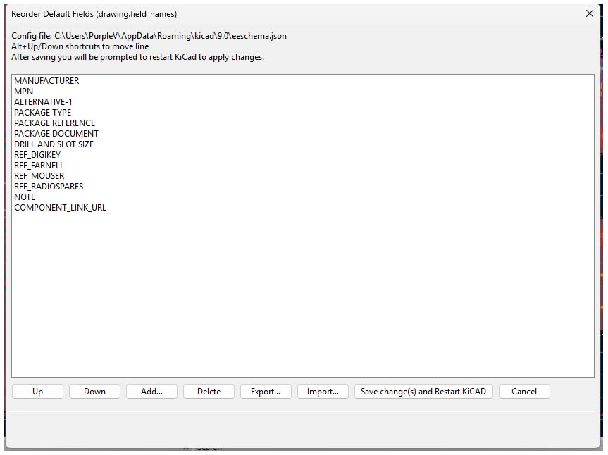

# Change Default Fields Order (KiCad 9)

**KiCad action plugin** to reorder the global **Default Fields** used by Eeschema.  
It edits the S-expression stored in:


## Why?

When placing new symbols, KiCad adds your Default Fields. This plugin:
- lets you reorder fields with mouse or **Alt+↑ / Alt+↓**
- preserves flags (`visible`, `url`, `visible url`) **inside** each `(field ...)`
- imports/exports a simple JSON list of names
- writes a `.bak` before saving
- can prompt to close KiCad after saving (so changes apply next launch)

## Requirements

- KiCad 9 (tested with Pcbnew action plugins on W11)
- Python embedded in KiCad (the usual default)
- `wxPython` and KiCad’s `pcbnew` module (already shipped with KiCad)

## Installation

1. Create the plugins folder if needed:
   - **Windows:** `%APPDATA%\kicad\9.0\scripting\plugins\`
   - **macOS:** `~/Library/Preferences/kicad/9.0/scripting/plugins/`
   - **Linux:** `~/.config/kicad/9.0/scripting/plugins/`

2. Copy:
   - `src/V_ChangeDefaultFieldsOrder.py` → into that `plugins` folder  
   - *(optional)* `assets/V_ChangeDefaultFieldsOrder.png` beside the script for a toolbar icon.

3. Restart **Pcbnew** → `Tools → External Plugins`.  
   You should see: **Change Default Fields Order (drawing.field_names)**

## Usage

1. Launch the plugin.
2. Reorder with buttons or **Alt+↑ / Alt+↓**.
3. **Save (Apply) + Restart**:
   - A `.bak` file is created.
   - You’ll be asked to close KiCad (recommended).  
     Re-open KiCad and your order appears under `Preferences → Schematic Editor → Default fields`.

> Notes
> - The plugin **only** changes the global defaults. It does not edit field order inside existing library symbols.
> - Flags are preserved (`visible`, `url`, `visible url`) and written correctly as  
>   `(field (name "NAME") visible url)`.

## Import / Export

- **Export** → writes `default_fields_order.json` (names only).
- **Import** → expects:
  ```json
  { "fields": ["MANUFACTURER", "MPN", "..."] }

 ## Custom change
If you do not want the plugin icon in the toolbar change  
self.show_toolbar_button = True  
to  
self.show_toolbar_button = False  
around line 401

## Screenshot

